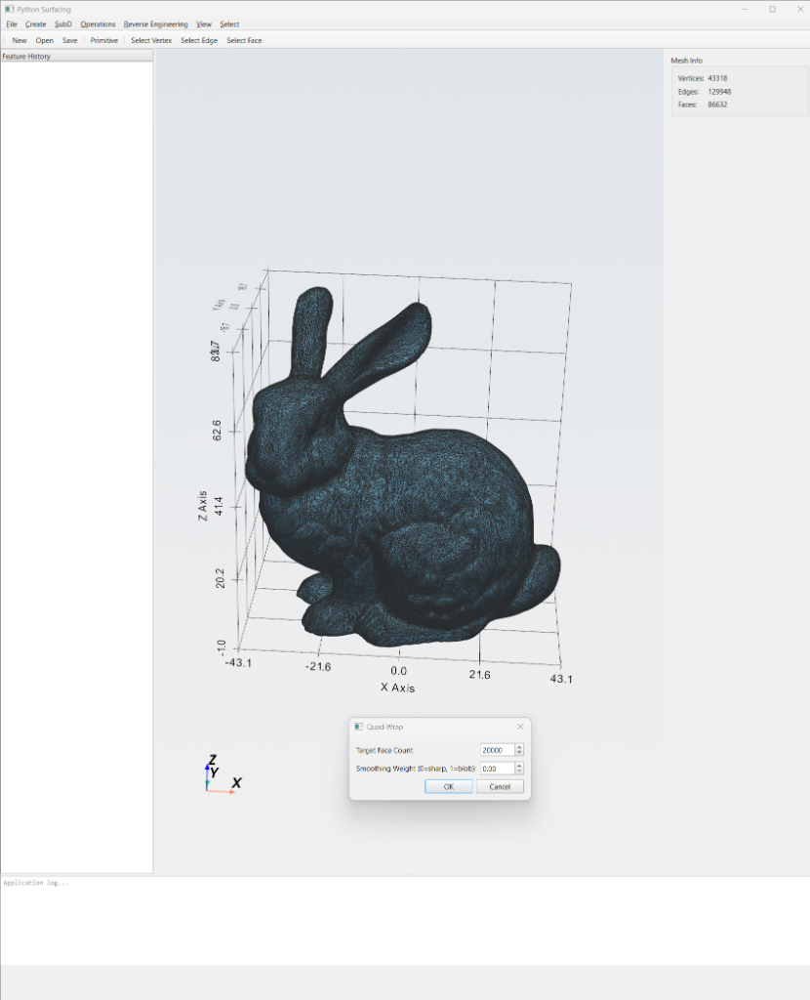

# Python Surfacing

<p align="center">
  <strong>Subdivision Surface Modeling &amp; Reverse Engineering Tool</strong><br>
  <em>Bridge organic Sub-D modeling with precise CAD — entirely in Python</em>
</p>

<p align="center">
  
  
  
  
</p>

---

## Overview

**Python Surfacing** is a desktop application for subdivision surface modeling and reverse engineering, inspired by modern CAD modeling tools. It bridges the gap between **fluid organic design** (Sub-D modeling) and **precise CAD engineering** (NURBS/B-Rep), enabling users to:

- 🎨 **Create** organic shapes using Catmull-Clark subdivision surfaces
- 🔄 **Convert** Sub-D meshes to NURBS B-spline patches
- 🔁 **Reverse engineer** dense meshes into clean quad control cages
- ⚙️ **Apply** advanced CAD operations (Shell, Thicken) that handle complex geometry
- 📁 **Import/Export** STEP, STL, and OBJ files

### Key Use Cases

| Domain | Application |
|--------|-------------|
| **Additive Manufacturing** | Smooth topology-optimized parts for SLM/3D printing |
| **Industrial Design** | Sculpt ergonomic consumer products with engineering precision |
| **Automotive** | Create Class A exterior surfaces with curvature continuity |
| **Prosthetics & Medical** | Convert body scans to clean, editable CAD geometry |
| **Reverse Engineering** | Transform 3D scans into lightweight parametric models |

---

## Features

### 🧊 Subdivision Surface Engine
- **Catmull-Clark subdivision** with configurable levels (1–5)
- **Edge weighting/creases** (0–100%) for sharp feature control
- **Limit surface evaluation** — compute exact positions without infinite subdivision
- **Primitive generators**: Box, Cylinder, Torus, Cone, Plane, Sphere

### ✏️ Interactive Mesh Editing
- **Extrude** faces and edges along normals or custom directions
- **Inset** faces to create detail rings
- **Insert Edge Loops** at arbitrary positions
- **Bridge** between face selections
- **Mirror** across axis planes with vertex merging
- **Soft Selection** with falloff radius (linear, smooth, sharp)

### 🔄 NURBS Conversion
- Sub-D → B-spline patch fitting
- G0/G1/G2 continuity enforcement between patches
- Optional export via OpenCascade (OCP) if installed

### 🔁 Reverse Engineering
- **Quad Wrap**: Automatic curvature-aligned quad retopology from dense triangle meshes
- **Shrink Wrap**: Project control cages onto reference surfaces with Laplacian smoothing
- **Mesh Tools**: Hole filling, Taubin smoothing, offset, decimation, quality metrics

### ⚙️ Advanced Operations
- **Shell**: Create thin-walled solids using SDF/voxel-based approach (handles self-intersections)
- **Thicken**: Convert surfaces to solids with uniform wall thickness
- Uses signed distance fields + marching cubes — inspired by "never-fail" offset techniques

### 🖥️ Professional GUI
- Dark-themed PySide6 desktop application
- PyVista-powered 3D viewport with interactive rendering
- Feature tree panel (parametric history with undo/redo)
- Dynamic properties panel
- Keyboard shortcuts for all common operations

---

## Screenshots



> *Launch the application to see the dark-themed CAD interface with 3D viewport, feature tree, and properties panel.*

---

## Installation

### Prerequisites
- **Python 3.10+** (tested with Python 3.14)
- **pip** package manager
- 64-bit operating system (Windows 10/11, Linux, macOS)

### Quick Install

```bash
# Clone the repository
git clone https://github.com/pmquang87/python-surfacing.git
cd python-power-surfacing

# Install dependencies
pip install -r requirements.txt

# Launch the application
python src/main.py
```

### Dependencies

| Package | Purpose |
|---------|---------|
| `numpy` | Vector math and array operations |
| `scipy` | B-spline fitting, spatial queries, distance transforms |
| `trimesh` | STL/OBJ mesh I/O and processing |
| `pyvista` | 3D visualization (VTK-based) |
| `pyvistaqt` | Qt integration for PyVista |
| `PySide6` | Desktop GUI framework (Qt6) |
| `networkx` | Graph operations for mesh topology |

### Optional Dependencies

| Package | Purpose |
|---------|---------|
| `cadquery` / `OCP` | STEP file import/export and NURBS operations via OpenCascade |
| `scikit-image` | Marching cubes for Shell/Thicken operations |

> **Note**: The application works fully without `cadquery`/`OCP`. STEP import/export will be unavailable, but all other features (STL/OBJ, Sub-D, reverse engineering) work out of the box.

---

## Usage

### Launching the GUI

```bash
cd python-power-surfacing
python src/main.py
```

### GUI Layout

```
┌──────────────────────────────────────────────────────┐
│  Menu Bar (File, Edit, Create, SubD, Mesh, RE, Ops)  │
│  ─────────────────────────────────────────────────── │
│  Toolbar                                             │
│  ─────────────────────────────────────────────────── │
│  │ Feature  │                         │ Properties  ││
│  │   Tree   │      3D Viewport        │   Panel     ││
│  │  Panel   │     (PyVista/VTK)       │             ││
│  │          │                         │             ││
│  ─────────────────────────────────────────────────── │
│  Status Bar (vertex/face count, current operation)   │
└──────────────────────────────────────────────────────┘
```

### Keyboard Shortcuts

| Shortcut | Action |
|----------|--------|
| `Ctrl+O` | Open file (STEP/STL/OBJ) |
| `Ctrl+S` | Save |
| `Ctrl+Z` | Undo |
| `Ctrl+Y` | Redo |
| `Ctrl+A` | Select All |
| `Delete` | Delete selected |
| `1` | Solid display mode |
| `2` | Wireframe display mode |
| `3` | Solid + Wireframe display mode |

### Menu Reference

| Menu | Items |
|------|-------|
| **File** | New, Open, Save, Export (STL/OBJ/STEP), Exit |
| **Edit** | Undo, Redo, Select All, Deselect |
| **Create** | Box, Cylinder, Torus, Cone, Plane, Sphere |
| **SubD** | Subdivide, Set Edge Weight, Insert Edge Loop |
| **Edit Mesh** | Extrude Faces, Extrude Edges, Inset, Bridge, Mirror, Soft Selection |
| **Reverse Engineering** | Quad Wrap, Shrink Wrap, Fill Holes, Smooth Mesh, Decimate |
| **Operations** | Shell, Thicken, Convert to NURBS |
| **View** | Solid, Wireframe, Solid+Wire, Reset Camera |

---

## Programmatic Usage

You can also use the modules directly in Python scripts:

### Subdivision Surface Example

```python
from src.subd.primitives import create_box
from src.subd.catmull_clark import subdivide, evaluate_limit_surface
from src.subd.editing import extrude_faces, set_edge_weight

# Create a Sub-D box control cage
box = create_box(width=2, height=1, depth=1)
print(f"Control cage: {len(box.vertices)} verts, {len(box.faces)} faces")

# Apply Catmull-Clark subdivision
smooth = subdivide(box, levels=2)
print(f"Subdivided: {len(smooth.vertices)} verts, {len(smooth.faces)} faces")

# Evaluate exact limit surface positions
limit_positions, limit_normals = evaluate_limit_surface(box)

# Add sharp creases
creased = set_edge_weight(box, edge_indices=[0, 1, 2, 3], weight=1.0)
sharp_smooth = subdivide(creased, levels=2)
```

### Reverse Engineering Example

```python
from src.io.importers import import_stl
from src.reverse_engineering.quad_wrap import QuadWrapper
from src.reverse_engineering.shrink_wrap import ShrinkWrapper
from src.io.exporters import export_obj

# Load a dense triangle mesh (e.g., from topology optimization or 3D scan)
dense_mesh = import_stl("my_scan.stl")

# Generate a clean quad control cage
wrapper = QuadWrapper(target_face_count=500, feature_angle=30.0)
control_cage = wrapper.wrap(dense_mesh)

# Shrink wrap for precise surface fit
shrinker = ShrinkWrapper(iterations=5, subdivision_levels=2)
fitted = shrinker.wrap(control_cage, dense_mesh)

# Export the clean quad mesh
export_obj(fitted, "clean_model.obj")
```

### Shell/Thicken Example

```python
from src.io.importers import import_stl
from src.operations.shell_thicken import shell_solid, thicken_surface

# Load a solid mesh
mesh = import_stl("part.stl")

# Create a thin-walled shell (SDF-based, handles complex geometry)
shelled = shell_solid(mesh, thickness=2.0, direction='inward', resolution=128)

# Thicken a surface into a solid
solid = thicken_surface(mesh, thickness=1.5, direction='both')
```

---

## Project Structure

```
python-power-surfacing/
├── README.md
├── LICENSE
├── .gitignore
├── requirements.txt
├── tests/
│   └── __init__.py
└── src/
    ├── __init__.py
    ├── main.py                          # Application entry point
    ├── core/
    │   ├── __init__.py
    │   ├── halfedge_mesh.py             # Half-edge mesh data structure
    │   └── feature_tree.py              # Parametric feature history
    ├── gui/
    │   ├── __init__.py
    │   ├── main_window.py               # PySide6 main window
    │   ├── viewport.py                  # PyVista 3D viewport
    │   ├── panels.py                    # Feature tree & properties panels
    │   └── dialogs.py                   # Operation parameter dialogs
    ├── io/
    │   ├── __init__.py
    │   ├── importers.py                 # STEP/STL/OBJ import
    │   └── exporters.py                 # STEP/STL/OBJ export
    ├── subd/
    │   ├── __init__.py
    │   ├── catmull_clark.py             # Catmull-Clark subdivision
    │   ├── primitives.py                # Primitive shape generators
    │   └── editing.py                   # Mesh editing operations
    ├── nurbs/
    │   ├── __init__.py
    │   └── converter.py                 # Sub-D → NURBS conversion
    ├── reverse_engineering/
    │   ├── __init__.py
    │   ├── quad_wrap.py                 # Quad retopology
    │   ├── shrink_wrap.py               # Surface projection
    │   └── mesh_tools.py                # Mesh repair utilities
    └── operations/
        ├── __init__.py
        └── shell_thicken.py             # Shell & Thicken via SDF
```

---

## Technical Background

This project implements concepts from advanced subdivision surface tools, translating them into an open-source Python framework:

### Catmull-Clark Subdivision
The core algorithm recursively smooths a coarse polygon mesh toward a theoretical **limit surface**. Each subdivision step computes:
- **Face points** — centroids of each face
- **Edge points** — weighted average of adjacent face/edge geometry
- **Vertex points** — valence-dependent stencil update

Edge **crease weights** (0–100%) allow smooth-to-sharp transitions, critical for industrial design where organic surfaces must meet precise parting lines.

### NURBS Conversion
The limit surface is evaluated analytically (without infinite subdivision) and fitted with **bicubic B-spline patches**, enforcing tangent (G1) and curvature (G2) continuity between adjacent patches for Class A surface quality.

### SDF-Based Shell/Thicken
Traditional CAD offset fails on high-curvature geometry due to self-intersections. This implementation uses a **Signed Distance Field** approach: voxelize the mesh, compute distances, extract isosurfaces via marching cubes — guaranteeing a valid result regardless of complexity.

---

## Contributing

Contributions are welcome! Areas where help is particularly valuable:

- [x] **GPU acceleration** for real-time subdivision (CUDA/OpenCL compute shaders)
- [x] **T-Spline support** for local refinement without global subdivision
- [x] **Improved NURBS fitting** with higher-order continuity (G3)
- [x] **Unit test coverage** for all modules
- [x] **Performance optimization** for meshes >1M faces
- [x] **Documentation** with visual examples and tutorials

### Development Setup

```bash
git clone https://github.com/YOUR_USERNAME/python-power-surfacing.git
cd python-power-surfacing
pip install -r requirements.txt
python -m pytest tests/          # Run tests
python src/main.py               # Launch GUI
```

---

## License

This project is licensed under the MIT License — see [LICENSE](LICENSE) for details.

---

## Acknowledgments

- **Commercial Sub-D CAD Tools** — The inspiration for this project's workflows
- **[IntegrityWare](https://www.integrityware.com/)** — Solids# kernel and Catmull-Clark NURBS conversion research
- **[Catmull & Clark (1978)](https://en.wikipedia.org/wiki/Catmull%E2%80%93Clark_subdivision_surface)** — Original subdivision surface algorithm
- **[PyVista](https://pyvista.org/)** — 3D visualization framework
- **[PySide6](https://doc.qt.io/qtforpython-6/)** — Qt6 Python bindings
- **[trimesh](https://trimesh.org/)** — Mesh processing library

---

<p align="center">
  Built with ❤️ for the CAD and computational geometry community
</p>
