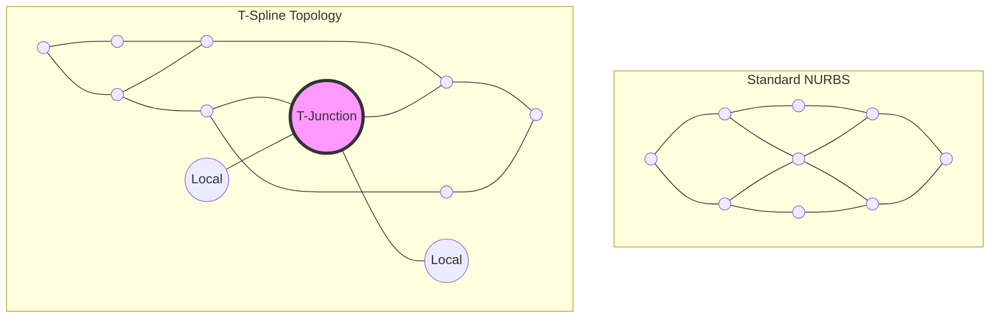
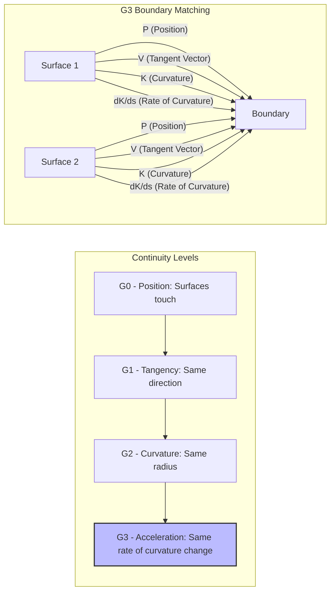

# Advanced Surface Modeling Features

This document provides visual tutorials and documentation for the advanced features introduced in our surface modeling toolkit: GPU Subdivision, T-Splines, and G3 NURBS.

## 1. GPU Subdivision

GPU Subdivision offloads the computational heavy lifting of surface refinement to the graphics processing unit. This allows for real-time visualization of high-density meshes.

### Key Benefits
*   **Real-time Performance:** Manipulate base meshes while seeing the subdivided limit surface instantly.
*   **Memory Efficiency:** Subdivision happens on the fly in the GPU pipeline (e.g., using tessellation shaders), saving host memory.
*   **Adaptive Tessellation:** Dynamic level of detail based on camera distance or surface curvature.

## 2. T-Splines

T-Splines are an evolution of NURBS that allow for local refinement without the need for control points to propagate across the entire surface. This is achieved by allowing T-junctions in the control grid.

### T-Spline Topology

The following diagram illustrates the difference between standard NURBS and T-Spline topology:

*In a standard NURBS grid, inserting a control point adds an entire row/column. In a T-Spline, a T-junction allows a partial row/column, drastically reducing the number of unnecessary control points.*

## 3. G3 NURBS (Curvature Acceleration Continuity)

G3 continuity goes beyond the standard G2 (curvature continuity) by ensuring that the *rate of change of curvature* (curvature acceleration) is also continuous across a surface boundary. This is critical for Class-A surfacing in automotive and aerospace design, as it prevents any visible "kinks" in reflections.

### G3 Continuity Visualized

Achieving G3 requires matching up to the 3rd derivative across the boundary, often requiring higher-degree NURBS curves (degree 7 or 9) and precise alignment of the first four rows of control points on either side of the boundary.
